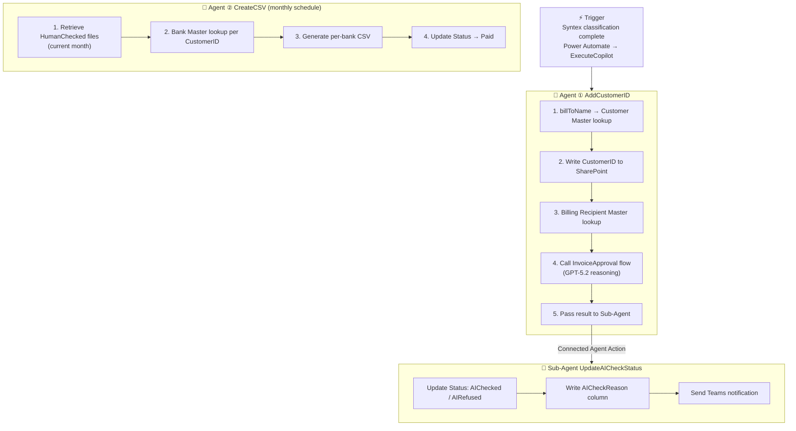
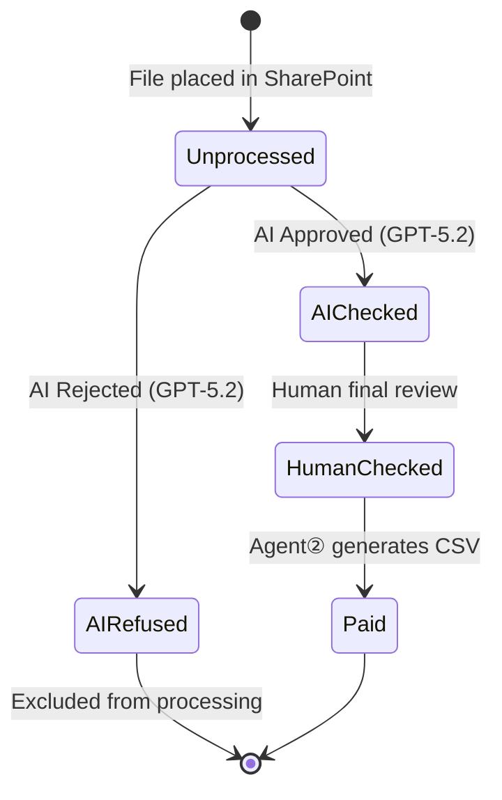
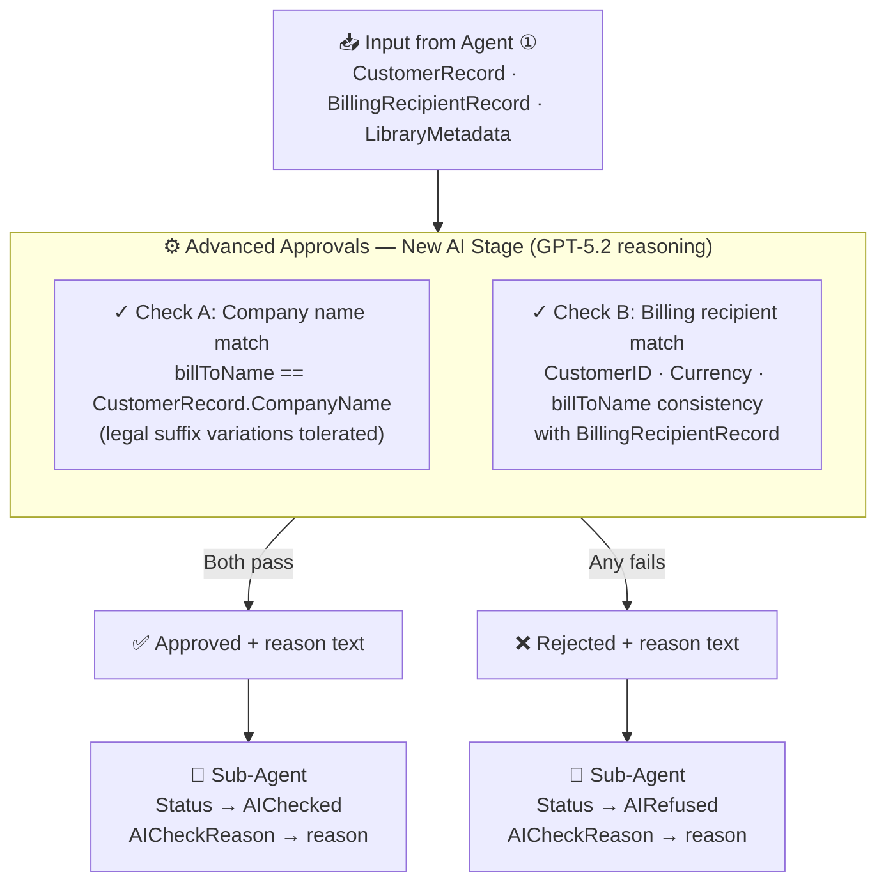

# Agent Implementation Architecture

## Purpose of This Document

This document summarizes the implemented Copilot Studio and Power Automate design in a format that is easy to explain for the hackathon.

The public repository does not include the raw Copilot Studio export files or environment-dependent workflow definitions. This document preserves the implementation structure without exposing those artifacts directly.

While the existing slides present a 2-agent structure (Agent ① and Agent ②), the actual implementation is a 3-component structure that includes a Sub-Agent called from Agent ①.

## Summary

This implementation processes invoices placed in SharePoint in the following order:

1. SharePoint AutoFill / Syntex extracts invoice data into columns
2. Agent ① identifies the Customer ID using billToName and performs AI check
3. Sub-Agent updates the SharePoint status and sends notifications
4. Human performs final review and sets HumanChecked
5. Agent ② collects HumanChecked invoices monthly and generates per-bank CSV files

## Agent Component Structure

### 1. Agent ①: AddCustomerID

- Role: Identify Customer ID, retrieve billing recipient information, trigger AI approval flow
- Trigger: After Microsoft Syntex file classification completes

### 2. Sub-Agent: UpdateAICheckStatus

- Role: Reflect AI judgment result in SharePoint and send notifications
- Caller: Agent ①'s Connected Agent Action

### 3. Agent ②: CreateCSV

- Role: Extract monthly target invoices and generate per-bank CSV files
- Trigger: Monthly schedule via Recurring Copilot Trigger

## Presentation Approach for Hackathon

### External Explanation

- SharePoint AI Layer
- Agent ①: Matching and AI check
- Agent ②: CSV generation

### Accurate Internal Implementation

- SharePoint AI Layer
- Agent ①: Customer ID assignment and AI check trigger
- Sub-Agent: Result reflection and notification
- Agent ②: Monthly CSV generation

This separation keeps slides simple while holding up under detailed Q&A about implementation.

## End-to-End Processing Flow

### Step 1. File Ingestion

- User places invoice in local or OneDrive sync folder
- File syncs to SharePoint document library

### Step 2. Structuring in SharePoint

- AutoFill / Syntex extracts column data from the invoice
- Downstream agents depend on columns such as billToName, Invoice Number, Due Date, Total Amount, supplierName
- Agent ① is triggered via the Syntex completion flow
    - Implementation basis: internal Power Automate trigger flow connected to Copilot Studio

### Step 3. Matching by Agent ①

Steps defined in Agent ①'s instructions:

1. Search Customer Master in Excel Online using billToName from the SharePoint file properties
2. Write the retrieved CustomerId to the CustomerID column of the SharePoint file
3. Search Billing Recipient Master in Excel Online using CustomerId
4. Call the InvoiceApproval flow to execute AI approval
5. Pass judgment result to the Sub-Agent

### Step 4. Result Reflection by Sub-Agent

The Sub-Agent handles:

1. If AI judgment is Approve: update Status to AIChecked
2. If AI judgment is Reject: update Status to AIRefused
3. Write judgment reason to the AICheckReason column
4. Send Teams notification to Manager or the executing user
5. Retrieve file URL and key columns and include in notification body

### Step 5. Human Review

- Both implementation and documentation confirm the design includes a human final review checkpoint
- Agent ② targets only HumanChecked invoices, so a manual approval step follows AIChecked

### Step 6. Monthly CSV Generation by Agent ②

Steps defined in Agent ②'s instructions:

1. Retrieve files from SharePoint where DueDate is within the current month AND Status is HumanChecked
2. For each file, look up Billing Recipient Master using CustomerID
3. Organize the following columns: BankName, BranchName, BranchCode, AccountType, AccountNumber, AccountName, TransferAmount
4. Create a CSV file per BankName
5. Update the Status of processed invoices to Paid

## Key Connectors Used

### SharePoint

- Get file properties from document library
- Update file properties in document library
- Create CSV file in OutputFile folder

### Excel Online

- Search Customer Master
- Search Billing Recipient Master

### Power Automate / Workflow

- Flow that triggers Agent ① after Syntex completion
- InvoiceApproval flow
- Recurring Copilot Trigger flow
- Hackathon_CreateFile flow

### Copilot Studio Connected Agent

- Agent ① calls Sub-Agent via Connected Agent Action

## Status Transitions

Key statuses readable from the implementation:

1. Unprocessed
2. AIChecked
3. AIRefused
4. HumanChecked
5. Paid

### How to Explain

- Unprocessed: Arrived in SharePoint, awaiting AI judgment
- AIChecked: AI judgment passed, awaiting human review
- AIRefused: Rejected by AI judgment
- HumanChecked: Human final review confirmed
- Paid: CSV output completed

Presenting this as a diagram conveys that agents not only process invoices but also use SharePoint columns for business state management.

## Architecture Key Points

### 1. SharePoint Is Not Just Storage

- File storage location
- Execution platform for AutoFill / Syntex
- Input foundation for agents
- Result reflection destination for agents
- Business state list management foundation

In other words, SharePoint serves as the knowledge foundation.

### 2. Agent Responsibilities Are Separated

- Agent ① handles per-invoice processing
- Sub-Agent handles status update and notification
- Agent ② handles monthly batch processing

Separated responsibilities yield both explainability and maintainability.

### 3. Humans Are Not Excluded

- HumanChecked is placed after AI judgment
- This is important for business governance and real-world operational fit

### 4. The Flow Reaches Output

- AI utilization does not end at classification or extraction
- The final result is an automatically generated per-bank CSV — a concrete business deliverable

This is a strong point for hackathon presentations.

## Points that Translate Well to Slides

### What to State Clearly on the Features Slide

- AI in SharePoint transforms invoices into structured metadata
- Agent ① handles Customer ID assignment and AI check
- Agent ② produces per-bank CSV from approved invoices

### What to Add on the Architecture Slide

- Agent ① internally uses Customer Master and Billing Recipient Master
- Agent ① is followed by a sub-agent for status updates
- Agent ② is not conversational — it runs on a monthly schedule trigger

### What to Emphasize on the Demo Slide

- Humans only Drop and Approve
- Column extraction, matching, judgment, notification, and CSV output are all automatic in between

## Ready-to-Use Talking Points

### 30-Second Version

This solution places invoices into SharePoint, where SharePoint AI first extracts the content into columns, Copilot Studio agents then perform customer matching and AI check, and finally approved invoices are used to automatically generate per-bank CSV files. SharePoint functions not as a file store but as the knowledge foundation that agents operate upon.

### 90-Second Version

There are two main agents in the implementation. The first is triggered after Syntex completes, uses billToName to look up the customer master, and writes Customer ID back to SharePoint. It then references the billing recipient master to run an AI check, and the result is reflected by a sub-agent into the SharePoint status and Teams notification. After that, only invoices confirmed by humans are collected monthly by the second agent, which generates per-bank payment CSV files. In summary, extraction, matching, approval preparation, and output are all connected through SharePoint at the center.

## Hackathon Strengths

- SharePoint organized library design and agent implementation are not decoupled
- SharePoint is specifically used as a grounding layer
- Customer ID and status accumulate in SharePoint and are reused in subsequent steps
- AI utilization does not stop at extraction — it reaches CSV generation as a business output

## InvoiceApproval Flow — Implementation Details

The InvoiceApproval flow called by Agent ① in Step 4 is triggered directly from Copilot Studio using a Power Automate Skills trigger.

### Overview

| Item | Details |
|------|---------|
| Trigger type | Request / Skills (called directly from Copilot Studio) |
| Inputs | CustomerRecord, BillingRecipientRecord, LibraryMetadata (all strings) |
| Processing | Advanced Approvals — **New AI stage** (GPT-5.2 reasoning) AI judgment |
| Outputs | approvalstatus (boolean: finalOutcome) + judgment reason text |

### How AI Judgment Works

The flow contains one **New AI stage** in Advanced Approvals using GPT-5.2 reasoning, which evaluates the following conditions:

**Approval Conditions (Approved only when BOTH are true):**

- A) Company name check: LibraryMetadata.billToName == CustomerRecord.CompanyName (case-insensitive, legal suffix variations tolerated)
- B) Billing recipient check:
  - LibraryMetadata.CustomerID == BillingRecipientRecord.CustomerID
  - LibraryMetadata.Currency == BillingRecipientRecord.Currency
  - LibraryMetadata.billToName == BillingRecipientRecord.BillToName (case-insensitive, legal suffix variations tolerated)

**Processing Rules:**
- Any condition fails → Rejected
- Any required input is missing or empty → Rejected
- Do NOT infer or fabricate missing values

### Judgment Reason Output and SharePoint Write-Back

The AI stage prompt instructs the model to always output a judgment reason (brief reason) in addition to Approved or Rejected.

This reason is recorded in SharePoint via the following path:

1. AI stage outputs "Approved/Rejected + reason text"
2. Agent ① receives both approval status and judgment reason
3. Agent ① passes status and reason to Sub-Agent (UpdateAICheckStatus)
4. Sub-Agent writes judgment reason to the SharePoint `AICheckReason` column

This enables tracking **why** a file became AIChecked/AIRefused at the column level within the SharePoint library.

### Key Points for Hackathon Explanation

- "AI approval" is a purely automated AI judgment with no human review stage (New AI stage only, no manual stage)
- High-accuracy matching judgment is implemented using GPT-5.2 reasoning
- Not only the boolean result but also the reason text accumulates in SharePoint, maintaining Explainability while automating

## Notes

- Syntex trigger flow detailed spec: covered in video demo
- UI / actor for updating to HumanChecked: covered in video demo
- Per-bank CSV format differences: see docs/sample/outputCSV/
- Error retry design: out of scope for this submission
- Master data quality management rules: out of scope for this submission
