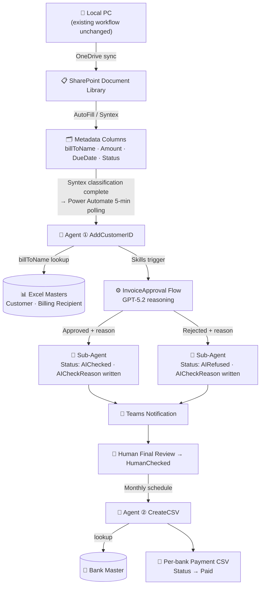
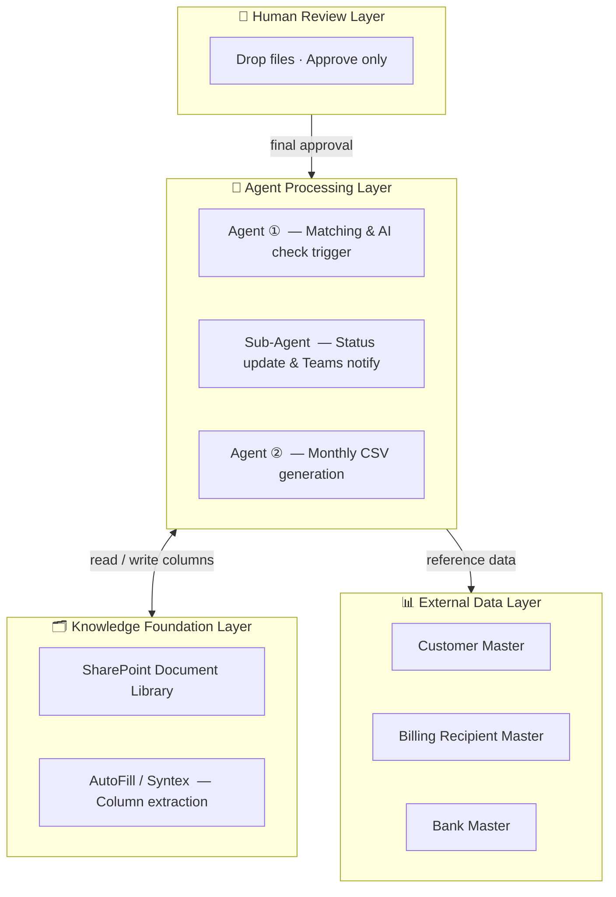

# Architecture

## Purpose

This project designs a Copilot Cowork where placing an invoice into SharePoint is all a user needs to do — organizing, matching, approval preparation, and per-bank CSV output all proceed automatically.

The core theme is automating business processing through information structure and agent responsibility separation, without changing the user's existing workflow.

## 4-Step Structure

### 1. Place Files from Local PC to SharePoint

- Users place invoices in their normal local folder
- OneDrive sync automatically reflects them in the SharePoint document library
- No new upload operation is required from the user

### 2. Structuring via AI in SharePoint

- AutoFill extracts key fields from the invoice
- Syntex verifies required fields and flags anomalies
- Extracted results are written back to SharePoint columns
- On Syntex classification complete, a Power Automate flow triggers Agent ①
    - Implementation basis: internal Copilot Studio export and Power Automate workflow definitions
    - Trigger: SharePoint classification completion detected by a polling flow
    - Action: the flow passes extracted library metadata to Agent ①

### 3. Matching and Registration by Copilot Studio Agent ①

- Takes invoice metadata from SharePoint as input
- References Customer Master and Billing Recipient Master
- Identifies Customer ID from Bill To name
- **New AI stage (GPT-5.2 reasoning)** inside the InvoiceApproval flow auto-evaluates two conditions:
  - Company name match: LibraryMetadata.billToName == CustomerRecord.CompanyName (tolerates legal suffix variations)
  - Billing recipient match: consistency check on CustomerID / Currency / BillToName
- AI judgment outputs Approved / Rejected + **reason text**
- Reason text is written to the SharePoint `AICheckReason` column via Sub-Agent
- Human performs final review after AI check and advances status to HumanChecked

### 4. CSV Generation by Copilot Studio Agent ②

- Targets only HumanChecked invoices
- Extracts invoices for the target month
- References Bank Master to supplement account information
- Generates per-bank payment CSV files

## Layer Design

### Knowledge Foundation Layer

- SharePoint Document Library
- Flat document management
- Metadata columns
- View switching
- AutoFill / Syntex

This layer is the core of the solution. It transforms invoice files into structured knowledge that agents can act upon.

### Agent Processing Layer

- Agent ①: matching and AI check trigger
- Sub-Agent: status update and notification
- Agent ②: monthly CSV generation

Each agent has a distinct responsibility. Agent ① handles matching and registration; Agent ② handles output generation.

### External Data Layer

- Customer Master
- Billing Recipient Master
- Bank Master

External masters provide the reference data that supports agent judgment accuracy — supplementing what the SharePoint invoice metadata alone cannot provide.

### Human Review Layer

- Human role is limited to Drop and Approve
- Automated results are not auto-confirmed — an approval checkpoint remains

This layer maintains business governance and explainability.

## Design Principles

- Use SharePoint as an AI grounding layer, not a file store
- Manage state via columns and views, not folder hierarchies
- Agents operate according to the SharePoint column design
- Reduce human work, but preserve the final confirmation checkpoint

## Architectural Outcomes

- "Invoices Arrive from Everywhere" → absorbed by OneDrive sync and SharePoint centralization
- "You Have to Open Every File" → resolved by column extraction and view-based browsing
- "Everything Is Manual" → resolved by Agent ②'s CSV generation

## Notes

- Trigger method details: covered in video demo
- SharePoint ↔ Copilot Studio connection implementation details are intentionally omitted from the public repository
- External master reference details: see docs/agent-implementation-architecture.md
- Error retry design: out of scope for this submission
