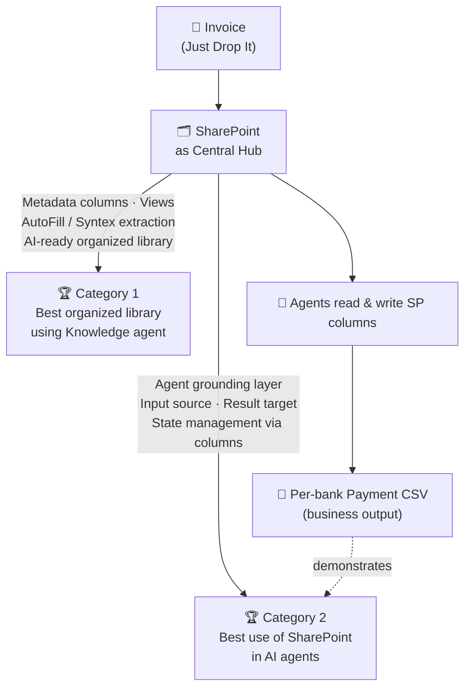

# Category Fit

## Target Categories

1. Best organized library using Knowledge agent
2. Best use of SharePoint in AI agents

## Fit for: Best organized library using Knowledge agent

In this category, the key question is how well the SharePoint library is organized and how AI-ready it is.

Our project's alignment points:

- Uses "just drop invoices" as the entry point, with AutoFill automatically extracting invoice information
- State management is done via metadata columns and views, not folder hierarchies
- Views can instantly switch perspective by due date, payee, status, and more
- Customer ID and check status accumulate in SharePoint, growing it as a knowledge foundation

In short, the strength is that the SharePoint library itself becomes an AI-ready organized library.

## Fit for: Best use of SharePoint in AI agents

In this category, the key question is how SharePoint is utilized in the context of AI agents.

Our project's alignment points:

- SharePoint functions as the grounding layer for agents
- Agent ① receives extracted information from SharePoint and performs Customer Master matching and Customer ID registration
- Agent ② receives approved information from SharePoint and generates per-bank CSV files
- Agent processing results flow back to SharePoint and become the prerequisite for the next step

In other words, SharePoint serves as both the precondition input and the result reflection target for agents — not merely a file store.

## Why Both Categories Are Satisfied Simultaneously

- The SharePoint design as an organized library directly generates agent utilization value
- Library design and agent design are not decoupled — they can be explained as one coherent business flow
- The flow from Drop to Payment Ready is connected through SharePoint at its center

## Presentation Strategy

- For Category 1: emphasize library organization, column design, and view design
- For Category 2: emphasize the role and automation scope of agents driven from SharePoint
- Unconfirmed implementation sections are noted as out of scope to maintain submission transparency
