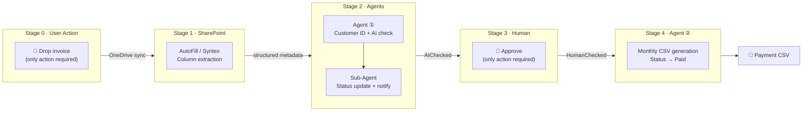

# Design Philosophy

## Keyword

Just Drop It

## What This Means

The user simply places an invoice file in their usual location.

All subsequent processing is handled by SharePoint and AI in the background.

- SharePoint receives the file
- AutoFill and Syntex extract and structure the content
- Agents handle matching, registration, and output preparation
- Humans only need to approve at the end

## Target Experience

Automate the majority of business processing while minimizing operational change.

Rather than teaching users new tool operations, the approach is to keep their current workflow nearly unchanged while redesigning what happens behind the scenes.

## Design Principles

### 1. Minimize Human Work

- Human actions are limited to Drop and Approve
- Eliminate the assumption that every file must be opened and read
- Leave only the final confirmation checkpoint to humans

### 2. Transform SharePoint into an AI-Ready Knowledge Foundation

- Prioritize metadata over folder hierarchies
- Extract document content into columns, present via views
- Build a structure on SharePoint that AI can act upon

### 3. Break Automation into Staged Responsibilities

- Extraction is handled by SharePoint
- Matching and registration are delegated to Agent ①
- Output generation is delegated to Agent ②

Using staged, responsibility-separated processing rather than one monolithic flow ensures both explainability and maintainability.

### 4. Make It Communicable as a Submission

- Explain in order: problem → concept → features → architecture → category fit
- Mark unconfirmed implementation sections explicitly as out of scope
- Exclude evaluation tooling; scope this submission to design explanation

## Why This Philosophy Is Needed

In invoice processing workflows, scattered storage locations, heavy verification tasks, and manual CSV creation occur in sequence. These appear to be separate issues, but the root cause is that information is not organized and not connected to the next step.

This design aims to keep storage and business processing connected — by centralizing information structure in SharePoint and having agents operate on top of it.

## Decision Criteria

- Has the number of user actions increased?
- Can business state be understood from SharePoint information alone?
- Is each agent's responsibility explainable?
- Is the human confirmation checkpoint clearly positioned?
