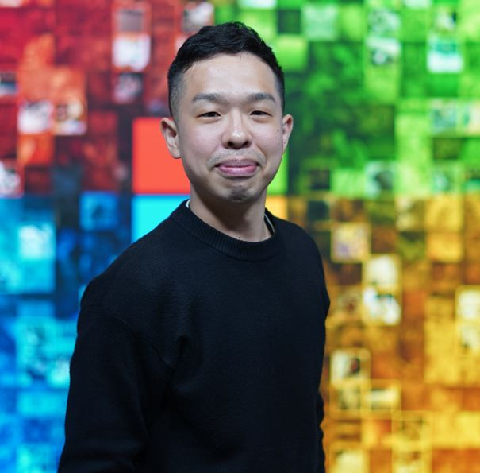
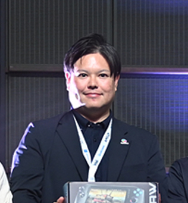
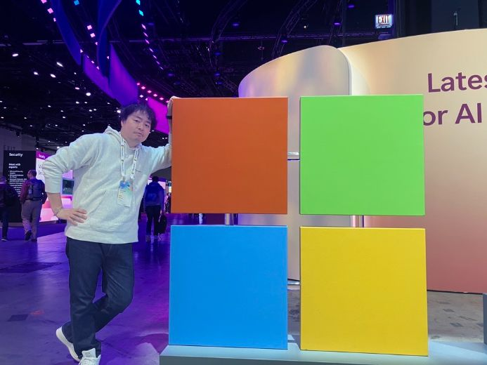

# 👥 Meet the Team — Copilot Cowork with SharePoint

**SharePoint Hackathon 2026** | Japan Business Systems (JBS)

---

## Team at a Glance

| | Name | Role | Highlights |
|---|------|------|-----------|
| 🅳 | **Yuichi Tsutsumi / Pepe** | Overall Lead | Microsoft MVP (M365 Copilot) · TPE Award 2023 & 2025 · Community Organizer of Anytime Copilot (Nandemo Copilot) |
| 🅲 | **Yasushi Shiroma** | Passion Leader & Presenter | Ph.D. (Engineering) · Windows AI Day Award 2026 |
| 🅱 | **Toshio Otsubo** | Design Leader | UX & workflow design · Windows AI Day Award 2026 |
| 🅰 | **Ryo Sekine** | Idea Leader | TPE Award 2024 (Azure) · Windows AI Day Award 2026 |

---

## 🅳 Yuichi Tsutsumi / Pepe — Overall Lead

**JBS, Inc. / AI Transformation Division**

Senior specialist in Microsoft Copilot Studio, Generative AI, and Power Platform. Leads enterprise-grade AI solution design, AI Solution Architecture, and AI governance. As the hackathon overall lead, he drove the project from ideation through full implementation — designing the three-agent pipeline, SharePoint library structure, and the Advanced Approvals AI stage (GPT-5.2 reasoning).

🏆 **[Microsoft MVP — M365 Copilot](https://mvp.microsoft.com/ja-JP/)**  
🏆 **[Anytime Copilot (Nandemo Copilot)](https://nandemo.connpass.com/)** — Community Organizer  
🏆 **[Microsoft Top Partner Engineer Award 2023](https://www.microsoft.com/ja-jp/partner/jp-tpeaward)** — Modern Work   
🏆 **[Microsoft Top Partner Engineer Award 2025](https://www.microsoft.com/ja-jp/partner/jp-tpeaward2025)** — Business Applications  

---

## 🅲 Yasushi Shiroma — Passion Leader & Presenter

**JBS, Inc. / AI Transformation Division**

Holds a Ph.D. in Engineering from the University of the Ryukyus. After joining JBS, he developed broad technical expertise across IoT, machine learning, generative AI, and Microsoft Copilot — driving real-world adoption in enterprise environments. He serves as the team's Passion Leader, bringing relentless energy, and as the primary presenter for the demo.

🏆 **Windows AI Day Idea Contest Winner** (March 2026)

---

## 🅱 Toshio Otsubo — Design Leader

**JBS, Inc. / Cloud Managed Services Division**

Manager covering a wide range of domains including user experience (UX), business process improvement, and AI agent development. Responsible for project management and workflow design, he led the visual and UX dimensions of this hackathon — from slide design to demo presentation structure.

🏆 **Windows AI Day Idea Contest Winner** (March 2026)

---

## 🅰 Ryo Sekine — Idea Leader

**JBS, Inc. / AI Transformation Division**

Leader of JBS's AI advancement division, with extensive experience in Microsoft Copilot, generative AI, and cloud strategy — from planning to execution. As the Idea Leader, he conceived the *"Just Drop It"* core concept that became the foundation of the entire solution.

🏆 **[Microsoft Top Partner Engineer Award 2024](https://www.microsoft.com/ja-jp/partner/jp-tpeaward2024)** — Azure  
🏆 **Windows AI Day Idea Contest Winner** (March 2026)

---

## 🏢 About JBS

> **Japan Business Systems (JBS)** is one of Japan's top Microsoft partners, holding multi-year consecutive records for the most Microsoft Top Partner Engineer Award recipients and winning the Japan Partner of the Year every year since 2013.  
> 🔗 [https://www.jbs.co.jp](https://www.jbs.co.jp)

---

## 💬 Speaking Notes (30 seconds)

> "Our team of four from JBS built a solution where placing an invoice in SharePoint is all a user needs to do — AI handles validation, status updates, and CSV export automatically. Ryo came up with the *Just Drop It* concept, Toshio brought it to life visually, Yuichi built the entire agent pipeline, and Yasushi is here to present it with full passion. We're proud to submit to both the Knowledge Agent Library and SharePoint in AI Agents categories."
